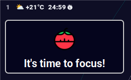

# pomobar-rs

`pomobar-rs` is a Waybar plugin that implements a Pomodoro timer.
The plugin utilizes socket-based communication between [Waybar](https://github.com/Alexays/Waybar) and pomobar.

## Installation

First, clone the repository:

```shell
git clone https://github.com/liminchian/pomobar-rs.git
cd pomobar-rs
```

Build the project using `cargo`:

```shell
cargo build --release
```

Install the binaries by copying them to their respective locations:

- `pomobar` (server) to `~/.local/bin/`
- `pomobar-cli` (client) to `~/.config/waybar/`

```shell
cp target/release/pomobar ~/.local/bin/pomobar
cp target/release/pomobar-cli ~/.config/waybar/pomobar-cli
```

## Usage

Launch the pomobar server before starting Waybar:

```shell
pomobar
```

Add the following configuration to your Waybar config:

```jsonc
{
  "custom/pomobar": {
    "format": "{} {icon}",
    "format-icons": {
      "idle": "",
      "paused": "",
      "work": "",
      "short_break": "",
      "long_break": "",
    },
    "interval": 1,
    "exec": "${HOME}/.config/waybar/pomobar-cli status",
    "on-click": "${HOME}/.config/waybar/pomobar-cli toggle",
    "on-click-middle": "${HOME}/.config/waybar/pomobar-cli reset",
    "return-type": "json",
  },
}
```

## Screenshots

Notification with [mako](https://github.com/emersion/mako)



Tootip


To see the notification icon, copy the icon file to `/usr/share/icons/hicolor/64x64/apps/pomobar.png`.

This project is inspired by [mt190502/pomobar](https://github.com/mt190502/pomobar)
